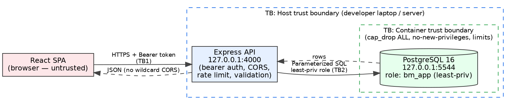

\newpage

# Executive Summary

Birthday Memory is an internal web application that stores personal information
about our people — full name, **date of birth**, phone number, and email address.
Before this engagement it shipped with **no authentication whatsoever**: anyone
who could send a web request to the service could read, alter, or delete every
record in the database. That combination of fields is a complete identity-theft
kit, so this was not "just birthdays" — it was an unprotected PII database.

I assessed all three layers of the system (the API, the database, and the
container) and then **remediated every issue in code**. The headline results:

- **The critical hole is closed.** The application now requires an
  authentication token on every data request and refuses to start without one.
  Anonymous requests are rejected; legitimate use is unaffected.
- **Blast radius is contained.** The application's database account was a
  full administrator ("superuser"); it is now a restricted account that can only
  read and write birthday rows. Committed passwords were removed. The database is
  no longer reachable from the network — only from the host itself.
- **Everything is proven, not asserted.** Each fix has before-and-after evidence
  and an automated test that will fail if the protection is ever removed. One
  "obvious" vulnerability (SQL injection) was **tested and found not to exist**;
  I have not reported it, to avoid giving the board a false alarm.

**The decision I need from the board:** approve this application to proceed to an
**internal** rollout under the hardened configuration delivered here, and fund
the next phase of work — per-user logins and encryption of stored data — **before
any customer-facing launch**. The residual risks that remain are understood,
documented, and covered by compensating controls in the meantime.

\newpage

# Scope and Methodology

**In scope (and only this):** my own fork of Birthday Memory, running on my own
machine, bound to `localhost`, seeded with synthetic (fake) data. Three domains
were assessed and remediated: the Express API, the PostgreSQL database, and the
Docker container.

**Out of scope / not performed:** the instructor's repository, any classmate or
UVU host, any cloud instance, and any internet exposure. No sustained
denial-of-service load was generated; availability weaknesses were demonstrated
with small, controlled proofs (e.g., a 110-request burst to trigger the new rate
limiter) as the rules of engagement require.

**Methodology.** Track B (Application Security). I followed a threat-model-first
approach aligned to **OWASP** guidance:

1. Draw the data-flow diagram and mark trust boundaries.
2. Run **STRIDE** at each boundary (Spoofing, Tampering, Repudiation, Information
   disclosure, Denial of service, Elevation of privilege).
3. Inventory the data assets and the regulations that attach to them.
4. Prioritize by risk (likelihood × impact) and remediate top-down.
5. Verify every fix with paired before/after evidence and an automated
   regression test. Target: **OWASP ASVS Level 1** with selected Level 2
   controls (see §7).

**Tools.** `curl` (request/response capture), Docker & `psql` (DB/container
inspection), **Trivy** (image vulnerability scan), **npm audit** (dependency
scan), git history search (committed-secret scan), and Node's test runner +
`supertest` (security regression tests). Standards referenced: OWASP Top 10
2021, OWASP ASVS, CIS Docker Benchmark, CVSS v3.1.

**Limitations.** This was a code-and-configuration assessment on a single host
with a small synthetic dataset. It did not include a production infrastructure
review, a formal penetration test by a third party, or load testing at scale.
Base-image operating-system CVEs are reported from Trivy but were not
individually exploit-tested. These limitations are stated so the board can weigh
the assurance level accurately.

\newpage

# System Overview and Trust Boundaries

Birthday Memory is three tiers: a React single-page app in the browser, an
Express API on the host, and a PostgreSQL database in a Docker container. Figure
1 shows the data flow and the three trust boundaries where controls must live.



**Trust boundaries and the controls now on each.**

| ID | Boundary | Primary controls after remediation |
|----|----------|------------------------------------|
| TB1 | Browser → API | Bearer authentication, CORS allowlist, rate limiting, input validation, security headers, body-size cap |
| TB2 | API → Database | Least-privilege DB role, parameterized SQL, statement timeout, loopback-only, secrets from environment |
| TB3 | Host → Container | Drop all capabilities, `no-new-privileges`, memory/CPU/PID limits, loopback port bind, pinned image |

**Asset inventory.** What we are protecting, and why it matters:

| Asset | Sensitivity | Why it matters |
|-------|-------------|----------------|
| Person record: name + **date of birth** + phone + email | High (PII) | Identity-theft kit; breach-notification trigger |
| Whole-table dataset | High | Mass scrape = bulk breach, higher notification cost |
| Database credentials | High | Full data compromise if leaked |
| API bearer token | High | Full CRUD over all records |
| Service availability | Low–Medium | Internal convenience tool |

\newpage

# STRIDE Summary

The full STRIDE analysis is in `security/threat-model/threat-model.md`. The table
below summarizes the highest-rated threat in each category and where it is
addressed.

| STRIDE category | Highest-rated threat | Addressed by |
|-----------------|----------------------|--------------|
| **S**poofing | Anyone can call the API as "the app" | F-01 bearer auth (fail-closed) |
| **T**ampering | Anonymous PUT rewrites any record | F-01 auth on writes + validation |
| **R**epudiation | No record of who changed data | Structured request logging; auth-gated actions |
| **I**nformation disclosure | Anonymous read of the whole PII table | F-01 auth; F-07 CORS/headers/error hygiene |
| **D**enial of service | Unbounded queries, no throttle | F-06 rate limit + query/body bounds |
| **E**levation of privilege | App DB account is a superuser | F-02 least-privilege role |

The single most important observation from the model: **every category's top
threat traced back to the same root cause — the absence of authentication and the
excess of privilege.** That is why F-01 and F-02 are ranked first and were fixed
first.

\newpage

# Findings and Remediations

Findings are ordered by risk. Each carries a CVSS v3.1 base score describing the
**pre-remediation** severity — i.e., the risk the board is being asked to retire.
Full technical detail, vectors, and evidence file names are in
`security/findings-and-remediations.md`; raw transcripts are in
`security/evidence/`.

## F-01 — No authentication: anonymous full control of all PII (Critical, 9.1)

`CVSS: AV:N/AC:L/PR:N/UI:N/S:U/C:H/I:H/A:N`

**What it was.** Every endpoint that reads, creates, updates, or deletes a
person's record was reachable with no credentials. I demonstrated all four:
listing every record, inserting a fake person, overwriting an existing record,
and deleting one — each with a single anonymous request.

*Metric justification:* Network attack vector; low complexity (one request); no
privileges or user interaction; high confidentiality **and** integrity loss
(read and write of all PII). Availability is scored under F-06.

**What I did.** Added bearer-token authentication middleware to every data route,
with a constant-time token comparison (so the token can't be guessed by timing).
The server **refuses to start** without a sufficiently long token — it cannot
accidentally run open again. The health-check endpoint is intentionally left open
for monitoring.

**Proof.** *Before:* anonymous `GET/POST/PUT/DELETE` all succeeded. *After:*
anonymous and wrong-token requests return `401 Unauthorized`; a request with the
valid token returns `200 OK` and works normally. Locked by regression tests 1–5.

> **Figure 2 — F-01 before/after (excerpts from `security/evidence/`).**
> ```
> BEFORE  $ curl -si http://localhost:4000/api/birthdays
>         HTTP/1.1 200 OK
>         [{"firstName":"Ada","lastName":"Lovelace","phone":"+1 415 555 0101", ...}]   # full PII, no auth
>
> AFTER   $ curl -si http://localhost:4000/api/birthdays
>         HTTP/1.1 401 Unauthorized            # anonymous rejected
>         $ curl -si -H "Authorization: Bearer <token>" .../api/birthdays?limit=2
>         HTTP/1.1 200 OK                        # authorized still works
> ```


**Trade-off.** A single shared token suits an internal, machine-to-machine tool
and was the fastest way to close a critical hole. It is **not** a per-user login;
that is the top item on the roadmap before any external launch.

## F-02 — Database account was a superuser (High, 8.8)

`CVSS: AV:N/AC:L/PR:L/UI:N/S:U/C:H/I:H/A:H`

**What it was.** The application logged into the database as a full administrator.
If any flaw ever let an attacker run database commands through the app, they would
have owned the entire database instance, not just the birthday table.

**What I did.** Created a restricted account (`bm_app`) that can only read and
write rows in the one table it needs — it cannot create or drop tables, create
users, or act as an administrator. The app now uses this account.

**Proof.** *Before:* the account showed `superuser = true` and could create/drop
any object. *After:* `superuser = false`; attempts to create or drop tables are
denied, while normal reads and writes still succeed.

> **Figure 3 — F-02 before/after (database privilege).**
> ```
> BEFORE  rolname | rolsuper | rolcreatedb | rolcreaterole
>         birthday|    t     |      t      |       t          # app account = superuser
>
> AFTER   rolname | rolsuper | rolcreatedb | rolcreaterole
>         bm_app  |    f     |      f      |       f
>         $ (as bm_app) CREATE TABLE evil(x int);
>         ERROR:  permission denied for schema public        # DDL denied; CRUD still works
> ```


## F-03 — Database password committed to a public repository (High, 7.5)

`CVSS: AV:N/AC:L/PR:N/UI:N/S:U/C:H/I:N/A:N`

**What it was.** The database password (`birthday`) was written directly into the
committed configuration, and the example environment file shipped working
defaults. On a public fork, that is a key taped to the front door.

**What I did.** Moved all secrets into an environment file that is excluded from
version control, and changed the example files to carry only `CHANGE_ME`
placeholders with instructions to generate strong values. No real secret is
committed. (The weak value remains in historical commits from before the fork;
it is dev-only and must never be reused — noted as residual risk.)

## F-04 / F-05 — Container exposed to the network and over-privileged (Medium)

`F-04 CVSS: AV:A/AC:L/PR:N/UI:N/S:U/C:H/I:N/A:N` · `F-05 CVSS: AV:L/AC:H/PR:L/UI:N/S:C/C:H/I:H/A:H`

**What it was.** The database port was published on all network interfaces
(reachable from the local network, not just the host), and the container ran as
root with every Linux capability and no resource limits.

**What I did.** Bound the port to `127.0.0.1` (host-only); dropped all container
capabilities and added back only the few Postgres needs to start; set
`no-new-privileges`; and applied memory, CPU, and process-count limits. The image
is pinned by digest so it can't be silently swapped.

**Proof.** *Before:* reachable on the host's LAN address. *After:* the LAN
address refuses the connection while `localhost` still works; the container
inspection confirms the dropped capabilities and limits.

## F-06 / F-07 — No rate limiting, unbounded queries, weak web hygiene (Medium)

`F-06 CVSS: AV:N/AC:L/PR:N/UI:N/S:U/C:L/I:N/A:L` · `F-07 CVSS: AV:N/AC:L/PR:N/UI:N/S:U/C:L/I:N/A:N`

**What it was.** No throttling (a client could hammer the API or scrape all
records unimpeded); some queries loaded the entire table into memory; cross-origin
requests were allowed from anywhere; standard security headers were missing; and
malformed input produced a server error that also revealed the framework in use.

**What I did.** Added rate limiting (100 requests / 15 minutes), capped page sizes
and query scans, limited request body size, added a strict cross-origin allowlist
and security headers, converted malformed-input errors to clean `400`/`413`
responses, and removed the framework-identifying header.

**Proof.** *Before:* 20 rapid requests all succeeded; a foreign origin was
accepted; bad JSON returned a `500`. *After:* excess requests return `429`; a
foreign origin is refused; bad JSON returns `400` and oversized bodies `413`.
Locked by regression tests 6–12.

> **Figure 4 — F-06/07 before/after (rate limiting, CORS, error handling).**
> ```
> BEFORE  20 rapid requests -> 200 200 200 ... (all succeed, no throttle)
>         Origin: https://evil.example.com -> Access-Control-Allow-Origin: *
>         POST bad JSON -> HTTP/1.1 500 Internal Server Error
>
> AFTER   110 requests -> 93x 200, 17x 429 (Too Many Requests)
>         Origin: https://evil.example.com -> (no ACAO header; blocked)
>         POST bad JSON -> HTTP/1.1 400 Bad Request {"error":"Malformed JSON body."}
> ```


## F-08 — Personal data stored in plaintext; transport not encrypted (Medium, partial)

`CVSS: AV:N/AC:H/PR:H/UI:N/S:U/C:H/I:N/A:N`

**What I did now.** Least-privilege database account, strong off-repo credentials,
host-only database access, and a TLS option that verifies the server certificate.
**Deferred (with compensating controls):** encrypting the phone/email fields at
rest and encrypting API-to-database traffic. Because the database is not reachable
from the internet and the account is now restricted, the residual exposure is
low; full encryption is scheduled in the roadmap.

## N-01 — SQL injection: tested and NOT present (the deliberate trap)

The assignment warned that one "obvious" vulnerability might not actually exist.
SQL injection is that item. The developers used parameterized queries correctly.
I tested it — the classic `' OR '1'='1` payload returns an empty list (the input
is treated as literal text, not code) and a stray quote causes no database error.
**I am therefore reporting SQL injection as verified-secure, not as a finding.**
Reporting it as real would have been a false positive to the board. A regression
test now guards this behavior.

\newpage

# Risk Analysis

**Likelihood × Impact, pre-remediation.**

| Finding | Likelihood | Impact | Risk (before) | Risk (after) |
|---------|-----------|--------|---------------|--------------|
| F-01 Auth | Almost certain | Severe (all PII, R/W) | **Critical** | Low |
| F-02 Superuser | Possible | Severe (DB takeover) | **High** | Low |
| F-03 Committed creds | Likely (public repo) | High | **High** | Low |
| F-04 Port exposure | Possible | High | **Medium** | Low |
| F-05 Container priv | Unlikely | High | **Medium** | Low |
| F-06/07 DoS/hygiene | Likely | Low–Med | **Medium** | Low |
| F-08 Plaintext PII | Possible | High | **Medium** | Medium (residual) |

**Risk matrix (pre-remediation position of each finding):**

|              | Impact: Low | Impact: Medium | Impact: High/Severe |
|--------------|-------------|----------------|---------------------|
| **Likely+**  |             | F-06/07        | **F-01, F-03**      |
| **Possible** |             | F-04           | **F-02, F-05, F-08**|
| **Unlikely** |             |                |                     |

**Business consequence in plain terms.** Before remediation, a single motivated
outsider on the same network — or anyone at all, had the app ever been exposed —
could have downloaded the entire directory of names and dates of birth. That is a
reportable personal-data breach in most jurisdictions, carrying notification
costs, potential regulatory penalties, and reputational damage disproportionate
to a "birthday app." After remediation, that path is closed and the remaining
risks are internal-only and compensated.

\newpage

# Regulatory and Compliance Considerations

The data set — name combined with date of birth, phone, and email — is
"personal information" under most modern privacy regimes. The following plausibly
apply and should be confirmed with counsel before any rollout beyond internal
staff:

- **US state breach-notification laws.** Name plus date of birth (and in many
  states an email address) commonly meets the definition of personal information
  that triggers breach-notification duties. An unauthenticated PII store is
  exactly the exposure these laws target.
- **CCPA/CPRA (California).** If any California residents' data is stored and the
  company meets the applicability thresholds, this data is "personal
  information" subject to reasonable-security obligations.
- **GDPR (EU/UK GDPR).** Applies only if any data subjects are in the EU/UK. If
  the tool is ever offered to customers internationally, GDPR's security
  (Art. 32) and breach-notification (Arts. 33–34) obligations would attach.
- **PCI DSS.** **Not currently applicable** — no payment card data is stored. It
  would become relevant only if payments were ever added. I note it explicitly so
  the board knows it was considered and correctly excluded.
- **Sector-specific rules (HIPAA, GLBA, FERPA).** Not applicable to this data as
  scoped; listed here to show they were considered and ruled out.

I have deliberately **not** claimed applicability of any framework whose triggers
this data does not meet. Overstating regulatory exposure to a board is as damaging
to credibility as missing it.

\newpage

# Recommendations and Roadmap

**Stop the bleeding — this week (COMPLETE in this deliverable):**
authentication (F-01), least-privilege DB account (F-02), secrets off-repo (F-03),
loopback binding and container hardening (F-04/05), rate limiting and web hygiene
(F-06/07). Effort: ~1 engineer-week; delivered.

**Before internal rollout (0–2 weeks):** operational items — put the app behind a
reverse proxy that terminates TLS; wire the security regression tests and scans
into CI; rotate the shared token and document the procedure. Effort: small.

**Before any customer-facing launch (next quarter):**

1. **Per-user authentication and authorization** — real accounts with
   `argon2`-hashed passwords, sessions or signed tokens, and an audit trail of
   who changed what. This replaces the shared token. *Effort: large.*
2. **Encryption of personal data at rest** — field-level or volume encryption
   with proper key management. *Effort: medium–large.*
3. **TLS end-to-end**, including API-to-database. *Effort: medium.*
4. **Base-image patching cadence** and read-only container filesystem. *Effort:
   small–medium.*

\newpage

# Conclusion

**My professional opinion: Birthday Memory is safe to proceed to an internal
rollout under the hardened configuration delivered here — and it must not go to
customers until per-user authentication and data-at-rest encryption are in
place.** The critical defect that made this an open PII database has been fixed
and proven; the blast radius of any future flaw has been sharply reduced; and the
issues that remain are internal-only, understood, and compensated. The app that
came into this engagement should not have shipped in any form. The app leaving it
is defensible for internal use and has a clear, costed path to customer-readiness.

\newpage

# Appendix A — Evidence Index

All raw transcripts are in `security/evidence/`. Before/after pairs:

| Finding | Before | After |
|---------|--------|-------|
| F-01 Auth | `before/B-01_B-02_*`, `before/B-03_B-04_*` | `after/F-01_auth_before_after.txt` |
| F-02 Superuser | `before/D2_database_privilege_transport.txt` | `after/D2_C_after_db_container.txt` |
| F-03 Secrets | `before/scans/secrets_git_history.txt` | (config; see `docker-compose.yml`, `.env.example`) |
| F-04/05 Container | `before/scans/container_posture.txt` | `after/D2_C_after_db_container.txt` |
| F-06/07 DoS/hygiene | `before/B-06_to_B-10_*` | `after/F-02_rate_limit.txt`, `after/F-03_*` |
| N-01 SQLi (negative) | `before/B-05_sqli_negative.txt` | test #13 in `after/security_tests_run.txt` |

Scanner output: `before/scans/trivy_postgres16-alpine_before.txt` (22
HIGH/CRITICAL in base image — residual, documented), `after/npm_audit_after.txt`
(0 vulnerabilities, server and client). Regression suite:
`after/security_tests_run.txt` (13/13 pass).

# Appendix B — CVSS Vectors (quick reference)

- F-01 `AV:N/AC:L/PR:N/UI:N/S:U/C:H/I:H/A:N` — 9.1 Critical
- F-02 `AV:N/AC:L/PR:L/UI:N/S:U/C:H/I:H/A:H` — 8.8 High
- F-03 `AV:N/AC:L/PR:N/UI:N/S:U/C:H/I:N/A:N` — 7.5 High
- F-04 `AV:A/AC:L/PR:N/UI:N/S:U/C:H/I:N/A:N` — 6.5 Medium
- F-05 `AV:L/AC:H/PR:L/UI:N/S:C/C:H/I:H/A:H` — 6.0 Medium
- F-06 `AV:N/AC:L/PR:N/UI:N/S:U/C:L/I:N/A:L` — 5.3 Medium
- F-07 `AV:N/AC:L/PR:N/UI:N/S:U/C:L/I:N/A:N` — 4.3 Medium
- F-08 `AV:N/AC:H/PR:H/UI:N/S:U/C:H/I:N/A:N` — 4.9 Medium

# Appendix C — References

- OWASP Top 10 (2021). https://owasp.org/Top10/
- OWASP Application Security Verification Standard (ASVS).
- OWASP Web Security Testing Guide (WSTG).
- CIS Docker Benchmark.
- FIRST CVSS v3.1 Specification. https://www.first.org/cvss/v3-1/
