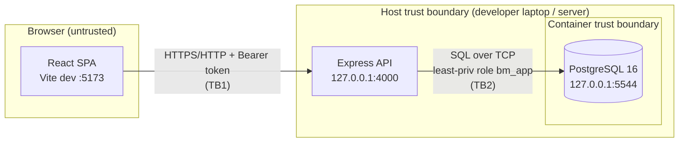

# Threat Model — Birthday Memory

**System:** Birthday Memory (React SPA + Express API + PostgreSQL)
**Author:** J. Hansen · CYBR 4550 Threat Actors · Track B (Application Security)
**Date:** 2026-09-18
**Methodology:** STRIDE per element, over an explicit data-flow diagram. ASVS
target level declared in [SECURITY.md](../../SECURITY.md).

---

## 1. Data Flow Diagram & Trust Boundaries

**Trust boundaries**

| ID  | Boundary | What crosses it | Control on the boundary |
|-----|----------|-----------------|--------------------------|
| TB1 | Browser → API | HTTP requests carrying PII and a bearer token | AuthN (bearer), CORS allowlist, rate limit, input validation, security headers |
| TB2 | API → Database | Parameterized SQL, credentials | Least-privilege role, statement timeout, loopback-only network, secret from env |
| TB3 | Host → Container | Docker runtime privileges | cap_drop ALL, no-new-privileges, resource limits, loopback port bind |

---

## 2. Asset Inventory

| Asset | Sensitivity | Notes / applicable regulation |
|-------|-------------|-------------------------------|
| Person record: full name + **date of birth** + phone + email | **High (PII)** | Complete identity-theft starter kit. GDPR (if any EU data subjects), CCPA/CPRA, US state breach-notification laws (e.g. name + DOB is often a "personal information" trigger). |
| Database credentials (superuser + app role) | High | Full data compromise if leaked. |
| API bearer token | High | Grants full CRUD over all records. |
| Aggregate dataset (whole table) | High | Mass scrape = bulk PII breach; higher notification cost than a single record. |
| Availability of the service | Low–Medium | Internal convenience tool; outage is inconvenient, not catastrophic. |

---

## 3. STRIDE Analysis

### TB1 — Browser → API

| STRIDE | Threat | Pre-remediation | Control applied |
|--------|--------|-----------------|-----------------|
| **S**poofing | Anyone can call the API as "the app" | No auth at all | Bearer-token AuthN, constant-time compare, fail-closed startup |
| **T**ampering | Anonymous PUT rewrites any record | No auth on writes | AuthN gate on all mutating routes; UUID + schema validation |
| **R**epudiation | No record of who changed what | No request logging | Structured request logging (pino), auth-required actions |
| **I**nfo disclosure | Anonymous read of entire PII table; verbose errors; framework fingerprint | Wildcard CORS, 500 leaks, `X-Powered-By` | AuthN, CORS allowlist, generic errors, `X-Powered-By` off, helmet CSP |
| **D**enial of service | Unbounded list/`upcoming` query; no rate limit; unbounded body | none | Pagination cap, row-scan cap, rate limiter, 16 kB body limit, statement_timeout |
| **E**oP | Any caller has full admin over data | No roles | AuthN required; per-user roles on the roadmap |

### TB2 — API → Database

| STRIDE | Threat | Pre-remediation | Control applied |
|--------|--------|-----------------|-----------------|
| Spoofing | Reuse of DB creds elsewhere | Trivial password `birthday`, committed | Strong generated password, env-only, not committed |
| Tampering | SQL injection | **Tested — parameterized, NOT vulnerable** | Kept parameterized; regression test locks it |
| Repudiation | — | — | DB logs; app-level logging |
| Info disclosure | Creds in repo; plaintext PII; cleartext transport | superuser, plaintext, `PGSSL=false` | Least-priv role, TLS-verify option, encryption on roadmap |
| DoS | Runaway query exhausts DB | none | statement_timeout, pool cap, container mem/cpu/pids limits |
| **EoP** | App role is **superuser** → full DB takeover | `rolsuper=t` | Dropped to `bm_app` (NOSUPERUSER, DML-only) |

### TB3 — Host → Container

| STRIDE | Threat | Pre-remediation | Control applied |
|--------|--------|-----------------|-----------------|
| Tampering | Container escape via excess capabilities | root, all caps | cap_drop ALL + minimal add, no-new-privileges |
| Info disclosure | DB port exposed to LAN | `0.0.0.0:5544` | Bound to `127.0.0.1` only |
| DoS | Container exhausts host memory/PIDs | no limits | mem 512m, cpus 1.0, pids 200 |
| EoP | Privilege escalation inside container | no-new-privileges unset | `no-new-privileges:true` |

---

## 4. Prioritized Remediation Roadmap

Ranking criterion: **risk = likelihood × impact**, with ties broken by
"stop-the-bleeding" effort (fix-now beats fix-later when cheap).

| # | Item | Why this rank | Effort |
|---|------|---------------|--------|
| 1 | **Authentication on all data endpoints** | Highest impact × highest likelihood: anonymous full CRUD over PII is exploitable by anyone who can reach the port, needs zero skill. Everything else is secondary to this. | S (done) |
| 2 | **Drop DB app role from superuser → least-priv** | If the API is ever compromised, superuser turns an app bug into total DB/host-adjacent takeover. Caps the blast radius. | S (done) |
| 3 | **Secrets out of the repo + strong values** | Committed `birthday` password is a standing key under the doormat; public fork makes it worse. | S (done) |
| 4 | **Container: loopback bind, cap_drop, limits** | Reduces external reachability and blast radius; cheap. | S (done) |
| 5 | **Rate limiting + body/query bounds** | Turns "unbounded" into "bounded"; blocks scraping and cheap DoS. | S (done) |
| 6 | **Security headers + CORS allowlist + error hygiene** | Defense-in-depth; low effort, closes fingerprinting and browser-side abuse. | S (done) |
| 7 | Per-user authentication & authorization (argon2, sessions/JWT, audit trail) | Bearer token gates anonymous access but is not per-user; needed before customer rollout. | L (next quarter) |
| 8 | Encryption of PII at rest (field-level or volume) + key management | Defense-in-depth for the plaintext-PII asset; deferred with compensating controls. | M–L |
| 9 | TLS everywhere (browser↔API, API↔DB) via reverse proxy | Required once off localhost. | M |
| 10 | Read-only container rootfs + tmpfs mounts | Marginal additional hardening. | S–M |

> Item 1 outranks item 2 because item 1 is directly exploitable by an
> unauthenticated remote party with a single HTTP request, whereas item 2
> requires the attacker to first gain code/query execution — it is a blast-radius
> multiplier, not a primary entry point.
